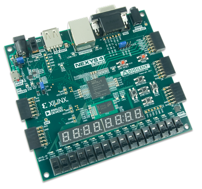
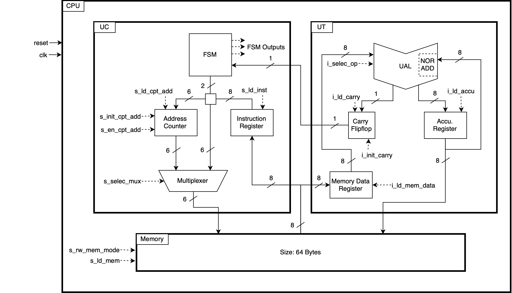
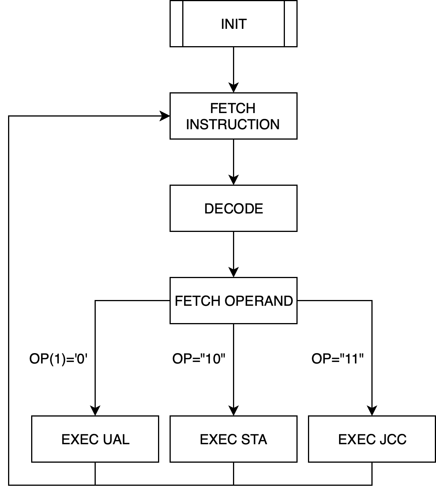

# Proco-8-bits

## Présentation

L'objectif de ce projet est de concevoir un processeur 8 bits disposant d'un jeu de 4 instructions élémentaires : Non-OU, Addition, Stockage mémoire, Saut d'adresse
Il est implémenté en VHDL pour pouvoir le déployer sur une carte de développement Nexys 4 DDR.
Ceci s'inscrit dans un cours de conception numérique enseigné à l'ENSEIRB-MATMECA de Bordeaux.

## Auteurs
Ce projet a été réaliser dans le cadre d'un projet de l'ENSEIRB-MATMECA. Nous sommes deux étudiants de la fillière par apprentissage SEE 2A.
* David DEVANT
* Aurélien TROMPAT

## Structure

